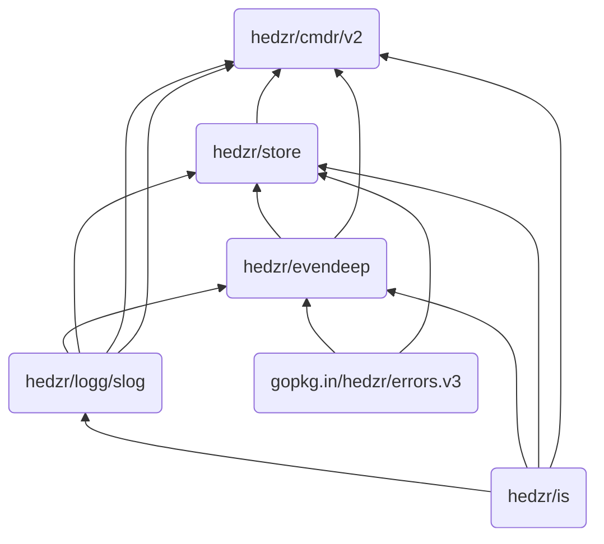

# cmdr


[](https://github.com/hedzr/cmdr/releases)
[](https://godoc.org/github.com/hedzr/cmdr) [](https://app.fossa.com/projects/git%2Bgithub.com%2Fhedzr%2Fcmdr?ref=badge_shield)
[](https://pkg.go.dev/github.com/hedzr/cmdr/v2)
[](https://goreportcard.com/report/github.com/hedzr/cmdr/v2)
[](https://codecov.io/gh/hedzr/cmdr/v2)<!--
[](https://coveralls.io/github/hedzr/cmdr/v2?branch=master)-->
[](https://github.com/avelino/awesome-go#command-line)
[](https://docs.hedzr.com/docs/cmdr.v2/)

`cmdr` is a POSIX-compliant, command-line argument parser library with Golang.

`cmdr` integrates app-settings manager (`Store`) for developing CLI app rapidly.

1. Our license moved to Apache 2.0 since v2.
2. The minimal toolchain moved to go1.24+ since v2.1.55.
3. DocSite published at [docs.hedzr.com](https://docs.hedzr.com/docs/cmdr.v2/).
4. Starting a new app with [cmdr-go-starter](https://github.com/hedzr/cmdr-go-starter) Template repo.
5. [Coming soon] Starting your app with [cmdr-cli] commandline tool.

The stable API starts since v2.1 and v2.2.

<!-- built by https://ezgif.com/ -->

## Motivation

There are many dirty codes in the cmdr.v1 which cannot be refactored as well. It prompted we reimplment a new one as v2.

The passing winter, we did rewrite the cmdr.v2 to keep it clean and absorbed in parsing and dispatching.
Some abilities were removed and relayouted to new modules.
That's why the `Option Store` has been split as a standalone module [hedzr/store](https://github.com/hedzr/store)[^1].
A faster and colorful slog-like logger has been implemented freshly as [hedzr/logg](https://github.com/hedzr/logg)[^3].
[hedzr/evendeep](https://github.com/hedzr/evendeep)[^2] provides a deep fully-functional object copy tool. It helps to deep copy some internal objects easily. It is also ready for you.
[hedzr/is](https://github.com/hedzr/is)[^4] is an environment detecting framework with many out-of-the-box detectors, such as `is.InTesting` and `is.InDebugging`.

Anyway, the whole supply chain painted:



> 1. The .netCore version [Cmdr.Core](https://github.com/hedzr/Cmdr.Core) is available now.
> 2. A cxx version [`cmdr-cxx`](https://github.com/hedzr/cmdr-cxx) was released (Happy Spring Festival 2021).
> 3. The docsite has been released at <https://docs.hedzr.com/>.

## Features

v2 is in earlier state but the baseline is stable:

- Basic command-line arguments parser like POSIX getopt and go stdlib flag.
  - Short flag, single character or a string here to support golang CLI style
    - Compact flags if possible. Also the sticky value will be parsed. For example: `-c1b23zv` = `-c 1 -b 23 -z -v`
    - Hit info: `-v -v -v` = `-v` (hitCount == 3, hitTitle == 'v')
    - Optimized for slice: `-a 1,2,3 -a 4 -a 5,6` => []int{1,2,3,4,5,6}
    - Value can be sticked or not. Valid forms: `-c1`, `-c 1`, `-c=1` and quoted: `-c"1"`, `-c'1'`, `-c="1"`, `-c='1'`, etc.
    - ...

  - Long flags and aliases
  - Eventual subcommands: an `OnAction` handler can be attached.
  - Eventual subcommands and flags: PreActions, PostAction, OnMatching, OnMatched, ...,
  - Auto bind to environment variables, For instance: command line `HELP=1 app` = `app --help`.
  - Builtin commands and flags:
    - `--help`, `-h`
    - `--version`, `-V`
    - `--verbose`. `-v`
    - ...

  - Help Screen: auto generate and print
  - Smart suggestions when wrong cmd or flag parsed. Jaro-winkler distance is used.

- Loosely parse subcmds and flags:
  - Subcommands and flags can be input in any order
  - Lookup a flag along with subcommands tree for resolving the duplicated flags

- Can integrate with [hedzr/store](https://github.com/hedzr/store)[^1]
  - High-performance in-memory KV store for hierarchical data.
  - Extract data to user-spec type with auto-converting
  - Loadable external sources: environ, config files, consul, etcd, etc..
    - extensible codecs and providers for loading from data sources

- Three kinds of config files are searched and loaded via `loaders.NewConfigFileLoader()`:
  1. __Primary__: main config, shipped with installable package.
  2. __Secondary__: 2ndry config. Wrapped by reseller(s).
  3. __Alternative__: user's local config, writeable. The runtime changeset will be written back to this file while app stopping.

- Variety of approaches for building command system with attached flags
  1. traditional stream calls (`app.Cmd("verbose", "v").Action(onVerbose)`)
  2. concise modes by [`Create`](https://pkg.go.dev/github.com/hedzr/cmdr/v2#Create) and cmd/xxcmd.go
  3. use [`Create.BuildFrom`](https://pkg.go.dev/github.com/hedzr/cmdr/v2#Create) to build cmdsys from a struct value via `[App.FromStruct]`, see example [#example_Create_buildFromStructValue](https://pkg.go.dev/github.com/hedzr/cmdr/v2/#example_Create_buildFromStructValue); or, attaching subcmds and flags to a subcmd by `app.Cmd().FromStruct(&root{})` following any traditional calls.

- Generating shell autocompletion scripts
  - supported shells are: zsh, bash, fish, powershell, ...
  - auto install the scripts for zsh shell.

- Generating command manpages for software deployment time.

- TODO
  - ...

[^1]: `hedzr/store` is a high-performance configure management library
[^2]: `hedzr/evendeep` offers a customizable deepcopy tool to you. There are also deepequal, deepdiff tools in it.
[^3]: `hedzr/logg` provides a slog like and colorful logging library
[^4]: `hedzr/is` is a basic environ detectors library

More minor details need to be evaluated and reimplemented if it's still meaningful in v2.

### News

Getting started from [New](https://pkg.go.dev/github.com/hedzr/cmdr/v2#New) or [Create](https://pkg.go.dev/github.com/hedzr/cmdr/v2#Create) function, and see the quickstart docs at [Concise Version - hzDocs](https://docs.hedzr.com/en/docs/cmdr.v2/guide/g02-concise-version/) and [Step by step - hzDocs](https://docs.hedzr.com/en/docs/cmdr.v2/guide/steps/).

Since v2.0.3, loaders had been splitted as a standalone repo so that we can keep cmdr v2 smaller and independer. See the relevant subproject [cmdr-loaders](https://github.com/hedzr/cmdr-loaders)[^5].

Since v2.1.12, we did main alternative features like autocompletion generating, manpage reading and generating, and made quite a lot of fixes and improvments. Now the main APIs come to stable.

Since v2.1.26, we added `App.FromStruct(structValue, opts...)` to build the command system from a struct-value, which deconstructs the given struct's definitions and constrcts the cmd-sys. And we also added `App.Cmd().FromStruct(&root{})` to build for a subcmd in a later release. Now the parsed cmdline args will be written into your struct value. For more detail, see also [From struct-value and Tag - hzDocs](https://docs.hedzr.com/en/docs/cmdr.v2/guide/steps/g13-build-from-struct/)

The full-functional tests and examples are moved into [cmdr-tests](https://github.com/hedzr/cmdr-tests).

[^5]: `hedzr/cmdr-loaders` provides an external config file loaders with GNU File Standard supports.

## History

v2.2 would be a stable version:

- v2.2.0 PLANNED: the final stable version for v2.
- v2.1.x: preview version for the new APIs.
- Full list: [CHANGELOG](https://github.com/hedzr/cmdr/blob/master/CHANGELOG)

## Guide

Please go to our docsite for these pages:

- [Concise Version - hzDocs](https://docs.hedzr.com/en/docs/cmdr.v2/guide/g02-concise-version/)
- [Step by step - hzDocs](https://docs.hedzr.com/en/docs/cmdr.v2/guide/steps/)
- ...

You can build command system by kinds of forms:

  1. traditional stream calls (`app.Cmd("verbose", "v").Action(onVerbose)`)
  2. concise modes by [`Create`](https://pkg.go.dev/github.com/hedzr/cmdr/v2#Create) and cmd/xxcmd.go
  3. use [`Create.BuildFrom`](https://pkg.go.dev/github.com/hedzr/cmdr/v2#Create) to build cmdsys from a struct value via `[App.FromStruct]`, see example [#example_Create_buildFromStructValue](https://pkg.go.dev/github.com/hedzr/cmdr/v2/#example_Create_buildFromStructValue); or, attaching subcmds and flags to a subcmd by `app.Cmd().FromStruct(&root{})` following any traditional calls.

### Traditional style

```go
	app.Cmd("soundex", "snd", "sndx", "sound").
		Description("soundex test").
		Group("Test").
		TailPlaceHolders("[text1, text2, ...]").
		OnAction(soundex).
		Build()
```

### Concise version

A typical cli-app can be (its concise version at [examples/tiny/concise/main.go](https://github.com/hedzr/cmdr/blob/master/examples/tiny/concise/main.go)):

```go
package main

import (
    "context"
    "io"
    "os"

    "github.com/hedzr/cmdr/v2"
    "github.com/hedzr/cmdr/v2/cli"
    "github.com/hedzr/cmdr/v2/examples/cmd"
    "github.com/hedzr/cmdr/v2/examples/dyncmd"

    "github.com/hedzr/is/dir"
    logz "github.com/hedzr/logg/slog"
    "gopkg.in/hedzr/errors.v3"
)

const (
    appName = "lite-app"
    desc    = `lite-app version of tiny app.`
    version = cmdr.Version
    author  = `The Example Authors`
)

func main() {
    ctx, cancel := context.WithCancel(context.Background())
    defer cancel()

    app := cmdr.Create(appName, version, author, desc).
        WithAdders(cmd.Commands...).
        Build()

    if err := app.Run(ctx); err != nil {
        logz.ErrorContext(ctx, "Application Error:", "err", err) // stacktrace if in debug mode/build
        os.Exit(app.SuggestRetCode())
    } else if rc := app.SuggestRetCode(); rc != 0 {
        os.Exit(rc)
    }
}

var Commands = []cli.CmdAdder{
    jumpCmd{},
    wrongCmd{},
    invokeCmd{},
    presetCmd{},
}

type jumpCmd struct{}

func (jumpCmd) Add(app cli.App) {
    app.Cmd("jump").
        Description("jump command").
        Examples(`jump example`). // {{.AppName}}, {{.AppVersion}}, {{.DadCommands}}, {{.Commands}}, ...
        Deprecated(`v1.1.0`).
        Group("Test").
        // Group(cli.UnsortedGroup).
        // Hidden(false).
        OnEvaluateSubCommands(dyncmd.OnEvalJumpSubCommands).
        OnEvaluateSubCommandsFromConfig().
        // Both With(cb) and Build() to end a building sequence
        With(func(b cli.CommandBuilder) {
            b.Cmd("to").
                Description("to command").
                Examples(``).
                Deprecated(`v0.1.1`).
                OnAction(func(ctx context.Context, cmd cli.Cmd, args []string) (err error) {
                    // cmd.Set() == cmdr.Set(), cmd.Store() == cmdr.Store()
                    cmd.Set().Set("tiny3.working", dir.GetCurrentDir())
                    println()
                    println("dir:", cmd.Set().WithPrefix("tiny3").MustString("working"))

                    cs := cmdr.Store().WithPrefix("jump.to")
                    if cs.MustBool("full") {
                        println()
                        println(cmd.Set().Dump())
                    }
                    cs2 := cmd.Store()
                    if cs2.MustBool("full") != cs.MustBool("full") {
                        logz.Panic("a bug found")
                    }
                    app.SetSuggestRetCode(1) // ret code must be in 0-255
                    return                   // handling command action here
                }).
                With(func(b cli.CommandBuilder) {
                    b.Flg("full", "f").
                        Default(false).
                        Description("full command").
                        Build()
                })
        })
}

type wrongCmd struct{}

func (wrongCmd) Add(app cli.App) {
    app.Cmd("wrong").
        Description("a wrong command to return error for testing").
        Group("Test").
        // cmdline `FORCE_RUN=1 go run ./tiny wrong -d 8s` to verify this command to see the returned application error.
        OnAction(func(ctx context.Context, cmd cli.Cmd, args []string) (err error) {
            dur := cmd.Store().MustDuration("duration")
            println("the duration is:", dur.String())

            ec := errors.New()
            defer ec.Defer(&err) // store the collected errors in native err and return it
            ec.Attach(io.ErrClosedPipe, errors.New("something's wrong"), os.ErrPermission)
            // see the application error by running `go run ./tiny/tiny/main.go wrong`.
            return
        }).
        Build()
}

type invokeCmd struct{}

func (invokeCmd) Add(app cli.App) {
    app.Cmd("invoke").Description(`test invoke feature`).
        With(func(b cli.CommandBuilder) {
            b.Cmd("shell").Description(`invoke shell cmd`).InvokeShell(`ls -la`).UseShell("/bin/bash").OnAction(nil).Build()
            b.Cmd("proc").Description(`invoke gui program`).InvokeProc(`say "hello, world!"`).OnAction(nil).Build()
        })
}

type presetCmd struct{}

func (presetCmd) Add(app cli.App) {
    app.Cmd("preset", "p").
        Description("preset command to inject into user input").
        With(func(b cli.CommandBuilder) {
            b.Flg("preset", "p").
                Default(false).
                Description("preset arg").
                Build()
            b.Cmd("cmd", "c").Description("inject `-pv` into user input cmdline").
                PresetCmdLines(`-pv`).
                OnAction(func(ctx context.Context, cmd cli.Cmd, args []string) (err error) {
                    _, err = app.DoBuiltinAction(ctx, cli.ActionDefault)
                    return
                }).Build()
        })
}
```

### From a struct value

Adding subcmds and flags to an existed command `multiCmd` is dead simple, this way:

```go
package cmd

import (
	"context"
	"os"

	"github.com/hedzr/cmdr/v2/cli"
	"github.com/hedzr/is"
	logz "github.com/hedzr/logg/slog"
)

type multiCmd struct{}

func (multiCmd) Add(app cli.App) {
	if is.DebuggerAttached() {
		logz.SetLevel(logz.TraceLevel)
		app.WithOpts(cli.WithArgs(os.Args[0], "~~tree"))
	}
	app.Cmd("multi", "m", "").
		Description("multi-level test and imported form struct").
		// Group("Test").
		TailPlaceHolders("[text1, text2, ...]").
		OnAction(soundex).
		FromStruct(root{}).
		With(func(b cli.CommandBuilder) {
			// b.FromStruct(&root{})
		})
}

type root struct {
	b   bool // unexported values ignored
	Int int  `cmdr:"-"` // ignored
	A   `title:"a-cmd" shorts:"a,a1,a2" alias:"a1-cmd,a2-cmd" desc:"A command for demo" required:"true"`
	B
	C
	F1 int
	F2 string
}

type A struct {
	D
	F1 int
	F2 string
}
type B struct {
	F2 int
	F3 string
}
type C struct {
	F3 bool
	F4 string
}
type D struct {
	E
	FromNowOn F
	F3        bool
	F4        string
}
type E struct {
	F3 bool `title:"f3" shorts:"ff" alias:"f3ff" desc:"A flag for demo" required:"true"`
	F4 string
}
type F struct {
	F5 uint
	F6 byte
}

// a --f1 1 --f2 str
// --a.f1 1 --a.f2 str

func (A) With(cb cli.CommandBuilder) {
	// customize for A command, for instance: fb.ExtraShorts("ff")
	logz.Info(".   - A.With() invoked.", "cmdbuilder", cb)
}
func (A) F1With(fb cli.FlagBuilder) {
	// customize for A.F1 flag, for instance: fb.ExtraShorts("ff")
	logz.Info(".   - A.F1With() invoked.", "flgbuilder", fb)
}

// Action method will be called if end-user type subcmd for it (like `app a d e --f3`).
func (E) Action(ctx context.Context, cmd cli.Cmd, args []string) (err error) {
	logz.Info(".   - E.Action() invoked.", "cmd", cmd, "args", args)
	_, err = cmd.App().DoBuiltinAction(ctx, cli.ActionDefault, stringArrayToAnyArray(args)...)
	return
}

// Action method will be called if end-user type subcmd for it (like `app a d f --f5=7`).
func (s F) Action(ctx context.Context, cmd cli.Cmd, args []string) (err error) {
	(&s).Inc()
	logz.Info(".   - F.Action() invoked.", "cmd", cmd, "args", args, "F5", s.F5)
	_, err = cmd.App().DoBuiltinAction(ctx, cli.ActionDefault, stringArrayToAnyArray(args)...)
	return
}

func (s *F) Inc() {
	s.F5++
}

func stringArrayToAnyArray(args []string) (ret []any) {
	for _, it := range args {
		ret = append(ret, it)
	}
	return
}
```

For the detail, or check out its bindable version, go to [From struct-value and Tag - hzDocs](https://docs.hedzr.com/en/docs/cmdr.v2/guide/steps/g13-build-from-struct/).

### Next Step

More examples please go to [cmdr-tests/examples](https://github.com/hedzr/cmdr-tests/tree/master/examples).

## License

Since v2, our license moved to Apache 2.0.

[](https://app.fossa.com/projects/git%2Bgithub.com%2Fhedzr%2Fcmdr?ref=badge_large)
