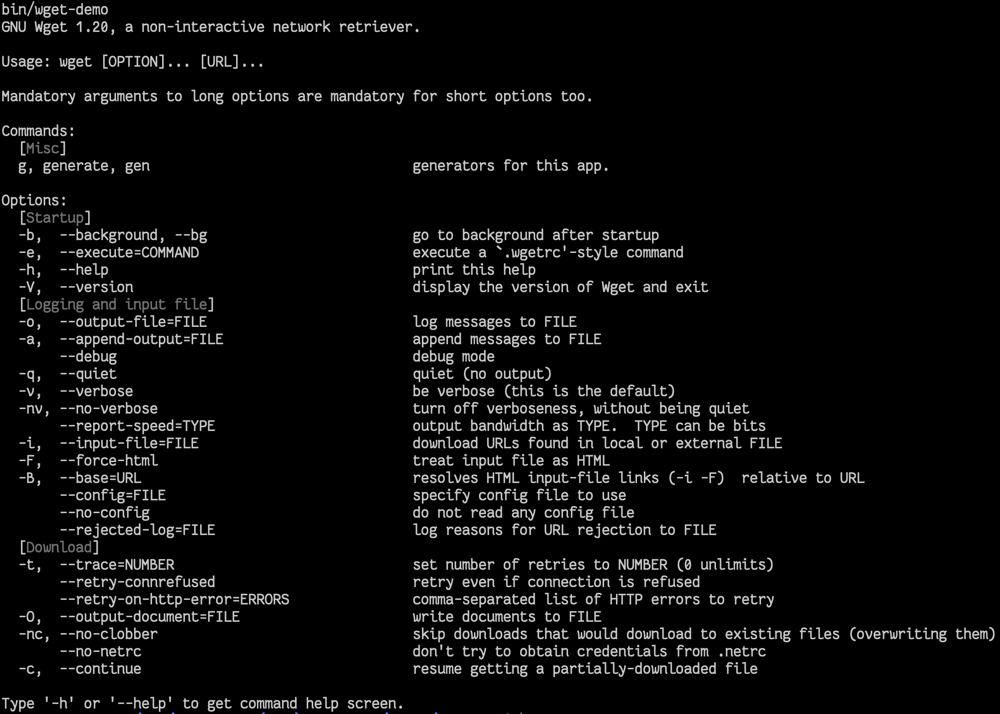

# cmdr

[](https://travis-ci.org/hedzr/cmdr)
[](https://goreportcard.com/report/github.com/hedzr/cmdr)

getopt/getopt_long like command-line UI golang library.

A getopt-like parser of command-line options, compatible with the [getopt_long](http://www.gnu.org/s/libc/manual/html_node/Argument-Syntax.html#Argument-Syntax) syntax, which is an extension of the syntax recommended by POSIX.

`cmdr` is a UNIX command-line UI library written by golang.


## Features

- Unix [*getopt*(3)](http://man7.org/linux/man-pages/man3/getopt.3.html) representation but without its programmatic interface.
- Automatic help screen generation
- Support for unlimited multiple sub-commands.
- Support for command short and long name, and aliases names.
- Support for both short and long options (`-o` and `—opt`). Support for multiple aliases
- Automatically allows both `-I file` and `-Ifile`, and `-I=files` formats.
- Support for `-D+`, `-D-` to enable/disable a bool flag.
- Support for circuit-break by `--`.
- Support for options being specified multiple times, with different values
- Support for optional arguments.
- Groupable commands and options/flags.
- Sortable commands and options/flags. Or sorted by alphabetic order.
- Bash and Zsh (not yet) completion.
- Predefined yaml config file locations:
  - `/etc/<appname>/<appname>.yml` and `conf.d` sub-directory.
  - `$HOME/<appname>/<appname>,yml` and `conf.d` sub-directory.
  - Watch `conf.d` directory:
    - `AddOnConfigLoadedListener(c)`
    - `RemoveOnConfigLoadedListener(c)`
    - `SetOnConfigLoadedListener(c, enabled)`
  - As a feature, do NOT watch the changes on `<appname>.yml`.
- Overrides by environment variables.
- `cmdr.GetBool(key)`, `cmdr.GetInt(key)`, `cmdr.GetString(key)`, `cmdr.GetStringSlice(key)` for Option value extraction.


## Examples

1. demo

2. **short**

   **short** app full codes:

   ```go
   package main
   
   import (
   	"fmt"
   	"github.com/hedzr/cmdr"
   )
   
   func main() {
   
   	// logrus.SetLevel(logrus.DebugLevel)
   	// logrus.SetFormatter(&logrus.TextFormatter{ForceColors: true,})
   
       // To disable internal commands and flags, uncomment the following codes
   	// cmdr.EnableVersionCommands = false
   	// cmdr.EnableVerboseCommands = false
   	// cmdr.EnableHelpCommands = false
   	// cmdr.EnableGenerateCommands = false
       
   	if err := cmdr.Exec(rootCmd); err != nil {
   		fmt.Printf("Error: %v", err)
   	}
   
   }
   
   var (
   	rootCmd = &cmdr.RootCommand{
   		Command: cmdr.Command{
   			BaseOpt: cmdr.BaseOpt{
   				Name:  "short",
   				Flags: []*cmdr.Flag{},
   			},
   			SubCommands: []*cmdr.Command{
   				serverCommands,
   				// msCommands,
   			},
   		},
   
   		AppName:    "short",
   		Version:    cmdr.Version,
   		VersionInt: cmdr.VersionInt,
   		Copyright:  "austr is an effective devops tool",
   		Author:     "Hedzr Yeh <hedzrz@gmail.com>",
   	}
   
   	serverCommands = &cmdr.Command{
   		BaseOpt: cmdr.BaseOpt{
   			Short:       "s",
   			Full:        "server",
   			Aliases:     []string{"serve", "svr"},
   			Description: "server ops: for linux service/daemon.",
   			Flags: []*cmdr.Flag{
   				{
   					BaseOpt: cmdr.BaseOpt{
   						Short:       "f",
   						Full:        "foreground",
   						Aliases:     []string{"fg"},
   						Description: "running at foreground",
   					},
   				},
   			},
   		},
   		SubCommands: []*cmdr.Command{
   			{
   				BaseOpt: cmdr.BaseOpt{
   					Short:       "s",
   					Full:        "start",
   					Aliases:     []string{"run", "startup"},
   					Description: "startup this system service/daemon.",
   					Action: func(cmd *cmdr.Command, args []string) (err error) {
   						return
   					},
   				},
   			},
   			{
   				BaseOpt: cmdr.BaseOpt{
   					Short:       "t",
   					Full:        "stop",
   					Aliases:     []string{"stp", "halt", "pause"},
   					Description: "stop this system service/daemon.",
   				},
   			},
   			{
   				BaseOpt: cmdr.BaseOpt{
   					Short:       "r",
   					Full:        "restart",
   					Aliases:     []string{"reload"},
   					Description: "restart this system service/daemon.",
   				},
   			},
   			{
   				BaseOpt: cmdr.BaseOpt{
   					Full:        "status",
   					Aliases:     []string{"st"},
   					Description: "display its running status as a system service/daemon.",
   				},
   			},
   			{
   				BaseOpt: cmdr.BaseOpt{
   					Short:       "i",
   					Full:        "install",
   					Aliases:     []string{"setup"},
   					Description: "install as a system service/daemon.",
   				},
   			},
   			{
   				BaseOpt: cmdr.BaseOpt{
   					Short:       "u",
   					Full:        "uninstall",
   					Aliases:     []string{"remove"},
   					Description: "remove from a system service/daemon.",
   				},
   			},
   		},
   	}
   )
   ```

   

3. wget-demo
   


## LICENSE

MIT.


