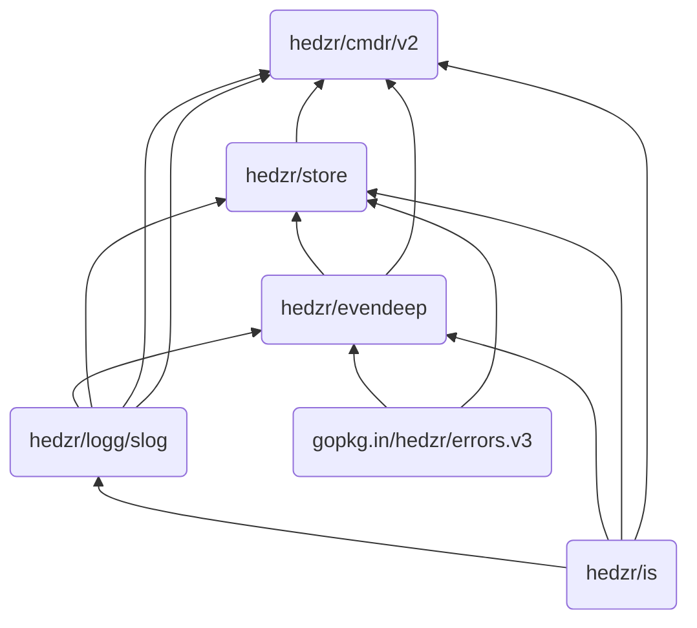

# cmdr


[](https://github.com/hedzr/cmdr/releases)
[](https://godoc.org/github.com/hedzr/cmdr) [](https://app.fossa.com/projects/git%2Bgithub.com%2Fhedzr%2Fcmdr?ref=badge_shield)
[](https://pkg.go.dev/github.com/hedzr/cmdr)
[](https://goreportcard.com/report/github.com/hedzr/cmdr)
[](https://codecov.io/gh/hedzr/cmdr)<!--
[](https://coveralls.io/github/hedzr/cmdr?branch=master)-->
[](https://github.com/avelino/awesome-go#command-line)

`cmdr` is a POSIX-compliant, command-line argument parser library with Golang. Since v2, our license moved to Apache 2.0.

<!-- built by https://ezgif.com/ -->

> ~~See the image frames at [#1](https://github.com/hedzr/cmdr/issues/1#issuecomment-567779978).~~

## Motivations

There are many dirty codes in the cmdr.v1 which cannot be refactored as well. It prompted we reimplment a new one as v2.

The passing winter, we did rewrite the cmdr.v2 to keep it clean and absorbed in parsing and dispatching.
Some abilities were removed and relayouted to new modules.
That's why the `Option Store` has been split as a standalone module [hedzr/store](https://github.com/hedzr/store)[^1].
A faster and colorful slog-like logger has been implemented freshly as [hedzr/logg](https://github.com/hedzr/logg).
[hedzr/evendeep](https://github.com/hedzr/evendeep) provides a deep fully-functional object copy tool. It helps to deep copy some internal objects easily. It is also ready for you.
[hedzr/is](https://github.com/hedzr/is) is an environment detecting framework with many out-of-the-box detectors, such as `is.InTesting` and `is.InDebugging`.

Anyway, the whole supply chain painted:



> The .netCore version [Cmdr.Core](https://github.com/hedzr/Cmdr.Core) is available now. A cxx version [`cmdr-cxx`](https://github.com/hedzr/cmdr-cxx) was released (Happy Spring Festival 2021).

## Features

v2 is in earlier state but the baseline is stable:

- Basic command-line arguments parser like POSIX getopt and go stdlib flag.
  - Short flag, single character or a string here to support golang CLI style
    - Compact flags if possible. Also the sticking value will be parsed. For example: `-c1b23zv` = `-c 1 -b 23 -z -v`
    - Hit info: `-v -v -v` = `-v` (hitCount == 3, hitTitle == 'v')
    - Optimized for slice: `-a 1,2,3 -a 4 -a 5,6` => []int{1,2,3,4,5,6}
    - Value can be sticked or not. Valid forms: `-c1`, `-c 1`, `-c=1` and quoted: `-c"1"`, `-c'1'`, `-c="1"`, `-c='1'`, etc.
    - ...

  - Long flags and aliases
  - Eventual subcommands: an `OnAction` handler can be attached.
  - Eventual subcommands and flags: PreActions, PostAction, OnMatching, OnMatched, ...,
  - Auto bind to environment variables, For instance: command line `HELP=1 app` = `app --help`.
  - Builtin commands and flags:
    - `--help`, `-h`
    - `--version`, `-V`
    - `--verbose`. `-v`
    - ...

  - Help Screen: auto generate and print
  - Smart suggestions when wrong cmd or flag parsed. Jaro-winkler distance is used.

- Loosely parse subcmds and flags:
  - Subcommands and flags can be input in any order
  - Lookup a flag along with subcommands tree for resolving the duplicated flags

- Can integrate with [hedzr/store](https://github.com/hedzr/store)[^1]
  - High-performance in-memory KV store for hierarchical data.
  - Extract data to user-spec type with auto-converting
  - Loadable external sources: environ, config files, consul, etcd, etc..
    - extensible codecs and providers for loading from data sources

- Three kinds of config files are searched and loaded via `loaders.NewConfigFileLoader()`:
  - Primary: main config, shipped with installable package.
  - Secondary: 2ndry config. Wrapped by reseller(s).
  - Alternative: user's local config, writeable. The runtime changeset will be written back to this file while app stopping.

- TODO
  - Shell autocompletion
  - ...


[^1]: `hedzr/store` is a high-performance configure management library

More minor details need to be evaluated and reimplemented if it's still meaningful in v2.

## History

v2 is staying in earlier state:

- Full list: [CHANGELOG](https://github.com/hedzr/cmdr/blob/master/CHANGELOG)

## Guide

A simple cli-app can be:

```go
package main

import (
	logz "github.com/hedzr/logg/slog"

	"github.com/hedzr/cmdr/v2"
	"github.com/hedzr/cmdr/v2/cli"
	"github.com/hedzr/cmdr/v2/loaders"
	"github.com/hedzr/cmdr/v2/pkg/dir"
	"github.com/hedzr/store"
)

func main() {
	app := prepareApp()

	// // simple run the parser of app and trigger the matched command's action
	// _ = app.Run(
	// 	cmdr.WithForceDefaultAction(false), // true for debug in developing time
	// )

	if err := app.Run(
		cmdr.WithStore(store.New()),
		cmdr.WithExternalLoaders(
			loaders.NewConfigFileLoader(),
			loaders.NewEnvVarLoader(),
		),
		cmdr.WithForceDefaultAction(true), // true for debug in developing time
	); err != nil {
		logz.Error("Application Error:", "err", err)
	}
}

func prepareApp() (app cli.App) {
	app = cmdr.New().
		Info("demo-app", "0.3.1").
		Author("hedzr")
	app.AddFlg(func(b cli.FlagBuilder) {
		b.Titles("no-default").
			Description("disable force default action").
			OnMatched(func(f *cli.Flag, position int, hitState *cli.MatchState) (err error) {
				app.Store().Set("app.force-default-action", false)
				return
			})
	})
	app.AddCmd(func(b cli.CommandBuilder) {
		b.Titles("jump").
			Description("jump command").
			Examples(`jump example`).
			Deprecated(`jump is a demo command`).
			Hidden(false)

		b.AddCmd(func(b cli.CommandBuilder) {
			b.Titles("to").
				Description("to command").
				Examples(``).
				Deprecated(`v0.1.1`).
				Hidden(false).
				OnAction(func(cmd *cli.Command, args []string) (err error) {
					app.Store().Set("app.demo.working", dir.GetCurrentDir())
					println()
					println(dir.GetCurrentDir())
					println()
					println(app.Store().Dump())
					return // handling command action here
				})
			b.AddFlg(func(b cli.FlagBuilder) {
				b.Default(false).
					Titles("full", "f").
					Description("full command").
					Build()
			})
		})
	})

	app.AddFlg(func(b cli.FlagBuilder) {
		b.Titles("dry-run", "n").
			Default(false).
			Description("run all but without committing")
	})

	app.Flg("wet-run", "w").
		Default(false).
		Description("run all but with committing").
		Build() // no matter even if you're adding the duplicated one.
	return
}
```


## Thanks to JODL

Thanks to [JetBrains](https://www.jetbrains.com/?from=cmdr) for donating product licenses to help develop **cmdr**  
[](https://www.jetbrains.com/?from=hedzr/cmdr)
[](https://www.jetbrains.com/?from=hedzr/cmdr)

## License

Since v2, our license moved to Apache 2.0.

The v1 keeps under MIT itself.

[](https://app.fossa.com/projects/git%2Bgithub.com%2Fhedzr%2Fcmdr?ref=badge_large)
